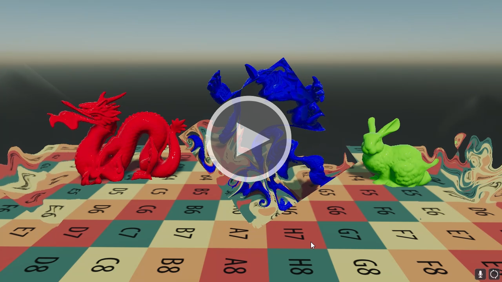
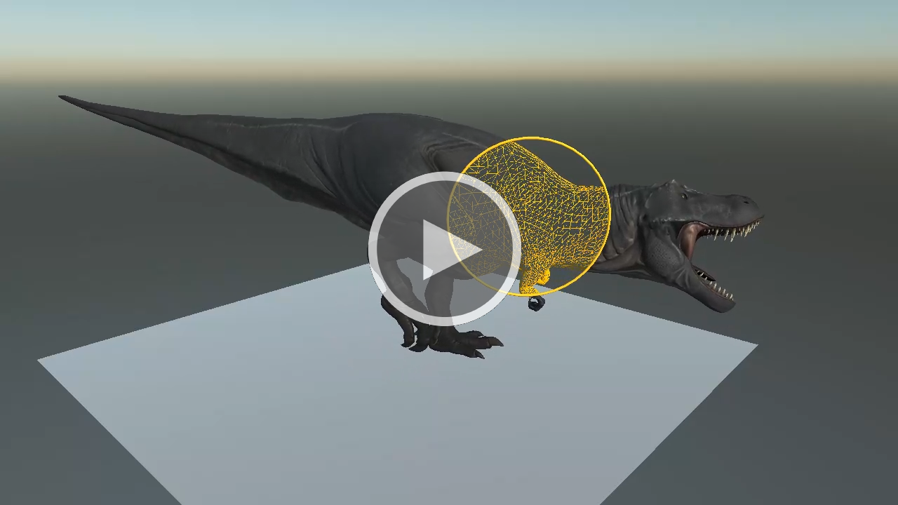
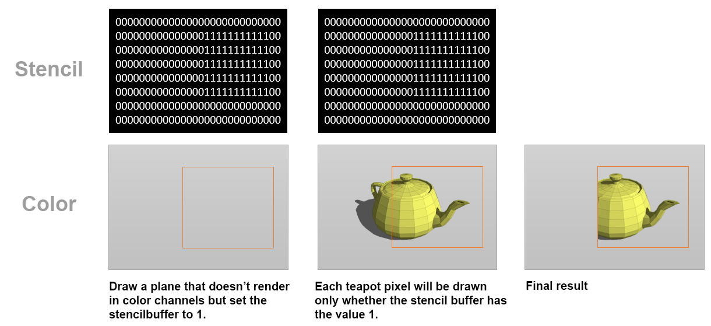
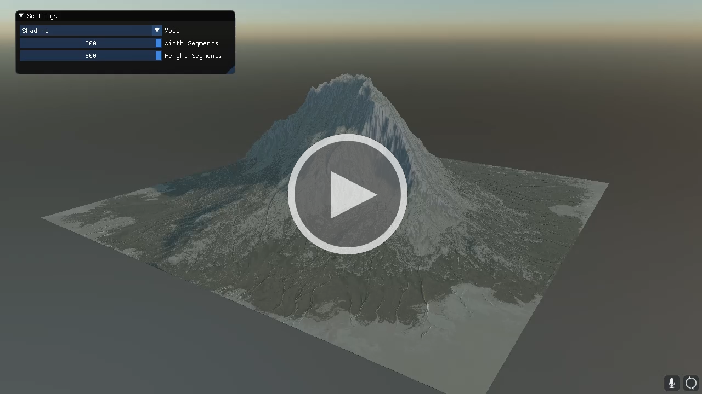
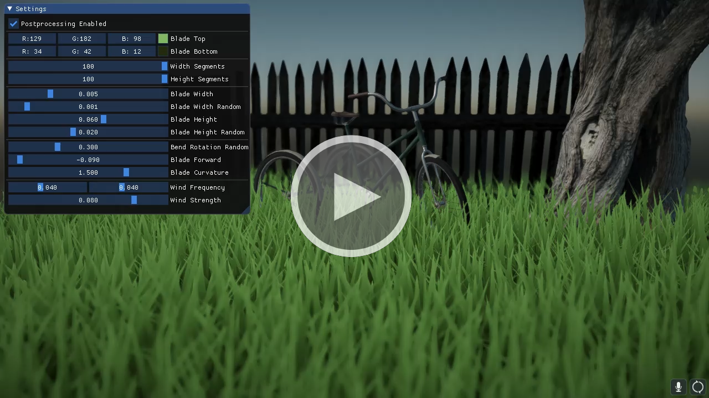
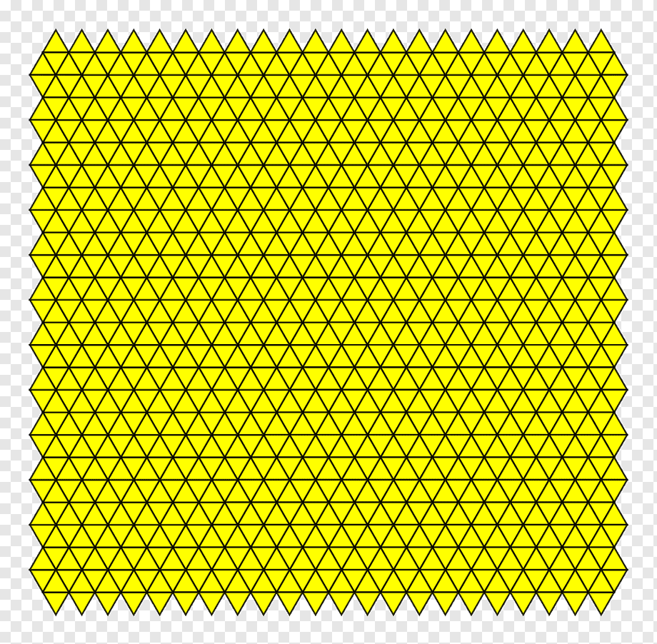
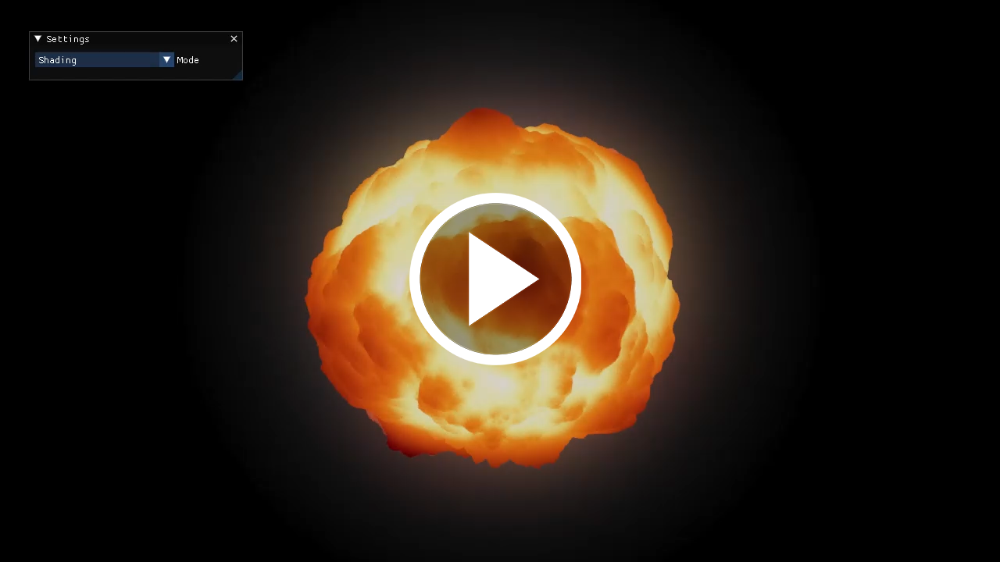
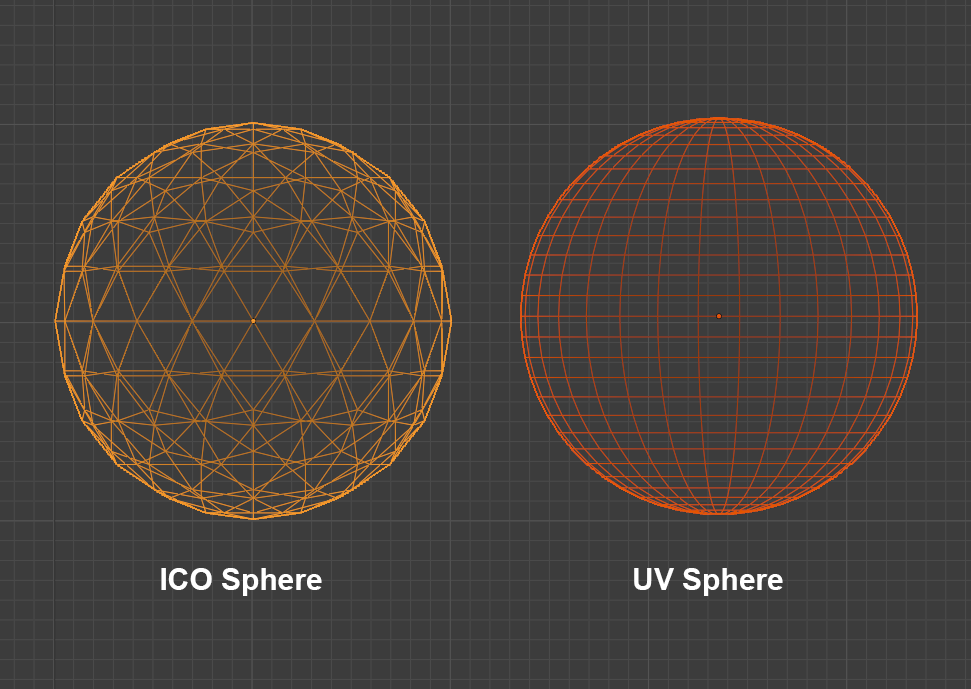
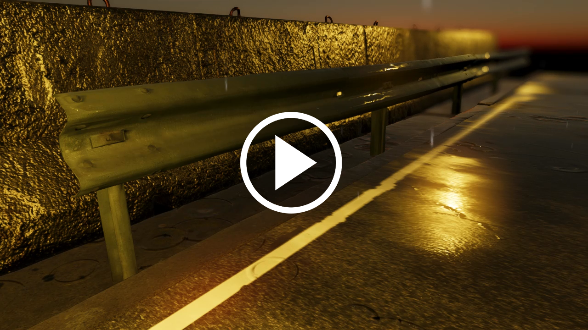
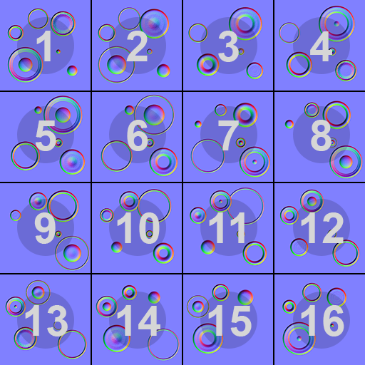

# Shader Effects Collection
This is a collection of visual effects created in [Evergine](https://evergine.com/). I have created these visual effects only for fun and you can use it to create your own effects.

## [Distortion](Distortion/)
[](https://www.youtube.com/watch?v=_LkSGxI8xbE)

Distortion is an effect of built-in Evergine. You only need to apply the _DistortionMat_ included in the **Evergine.Core** package and added a postprocessing volume to your scene and enabled it in Tonemapping section.

## [Stencil buffer trick](StencilBuffer/)
[](https://www.youtube.com/watch?v=unQRQKMhPYo)

This demo was created without wrote any line of code. The idea is that you can draw a geometry (plane, circle, anything) and draw only in the stencil buffer with a specify value. Now the next drawcall draw another geometry only whether the stencil buffer has this specify value. In the following picture I explain the trick:



## [Height map](HeightMap/)
[](https://www.youtube.com/watch?v=XSc4HVF5V8g)

In this demo, I created a MultipleMeshesPlane component that allows creating a plane with multiple horizontal and vertical segments. That is important to increase the resolution of your terrain. I am using a ushort (16 bit) indexbuffer so the maximum number of indices used in a drawcall are ushort.MaxValue (65535 indices). That is the reason why a split the plane geometry in multiple meshes. Each mesh has 100x100 segments 10000 quads so 60000 indices.

I applied the height map texture in the vertex shader to deform the geometry, you only need to remember that you must use shader model 5.0 to sample a texture in vertex shader and the code is:

```cpp
float height = HeightTexture.SampleLevel(Sampler, input.TexCoord,0).r;
float3 position = input.Position + input.Normal * (height * HeightAmount);
output.Position = mul(position, WorldViewProj);		
```
Where the HeightAmount is the maximum height amount of the terrain.

Finally, the most important part is computing the normals based on the heightmap. For this proposal, I sampled the heightmap 4 times in a cross to calculate the slope in the pixel shader stage.

```cpp
float3 getNormal(float2 uv, float texelSize) 
{
    float u = HeightTexture.SampleLevel(Sampler,  uv + texelSize * float2(0.0, -1.0), 0).r;
    float r = HeightTexture.SampleLevel(Sampler,  uv + texelSize * float2(-1.0, 0.0),0).r;
    float l = HeightTexture.SampleLevel(Sampler,  uv + texelSize * float2(1.0, 0.0),0).r;
    float d = HeightTexture.SampleLevel(Sampler,  uv + texelSize * float2(0.0, 1.0),0).r;

    float3 n;
    n.z = u - d;
    n.x = r - l;
    n.y = 1.0 / 256;
    return normalize(n);
}
```
I found a good reference for creation terrain based on heightmap in the paper **Terrain Rendering in Frostbite** from SIGGRAPH 2007 that you can download [here](http://citeseerx.ist.psu.edu/viewdoc/download?doi=10.1.1.161.8979&rep=rep1&type=pdf)

## [Grass shader](Grass/)
[](https://www.youtube.com/watch?v=yJBb9ijypsI)

For this demo, I created a SingleMeshPlane that creates a plane with a maximum of 100 horizontal and vertical segments with the following pattern.



Using a geometry shader I created a blade of grass per each mesh vertex. The blade grass is a shape with several segments to allow create a curve blade.


This demo is based on this great [post](https://roystan.net/articles/grass-shader.html) by Roystan.

## [Fireball shader](Fireball/)
[](https://youtu.be/GTiWvuKpxJM)

For this demo I used Blender to create an ICO sphere with a high tesselation, this geometry allows showing the deformation better than a common UV sphere based on quads.



Using [Classic Perlin 3D Noise by Stefan Gustavson](https://weber.itn.liu.se/~stegu/simplexnoise/simplexnoise.pdf) is possible to deform the vertices of the sphere following the generated noise. The vertex position will be:

_vertexPosition + vertexNormal * GeneratedNoise_

Animating the noise and coloring the sphere with a gradient texture is possible to get amazing effects.

This demo is based on this [GLSL explosion effect](https://www.clicktorelease.com/code/perlin/explosion.html)

## [Raindrop shader](Raindrop/)
[](https://youtu.be/37WrMrPxJE0)

In this demo, the raindrop effect is added such as an additional animated normal texture. To create the ripples effects I used the following normal texture:



This texture is added over the normal texture of the material. The texture is an animated spritesheet that contains 16 frames. The following code gets the current tile frame:

```cpp
// TilesWidth = 4
// TilesHeight = 4
float tile = fmod(floor(Time * Speed), TilesWidth * TilesHeight);
float2 tileCount = float2(1.0.xx) / float2(TilesWidth, TilesHeight);
float tileY = floor(tile / 4);
float tileX = fmod(tile, TilesWidth);
float2 coords = (input.TexCoords + float2(tileX, tileY)) * tileCount;

```

Finally, I added a multiplier rain texture. This texture allows for simulating where there are pools of water on the road and where not.

